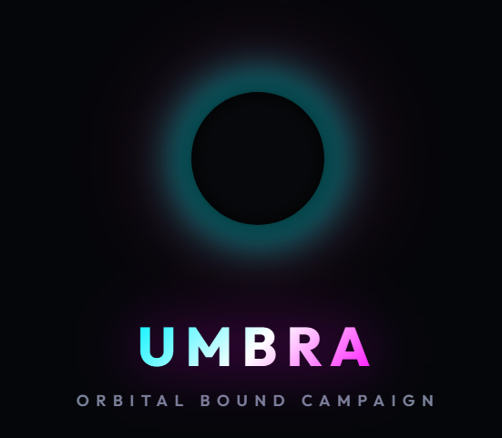

# UMBRA - Defeat Bosses Game

**Free Game!**  
*UMBRA by Silent gho3t*

[Play UMBRA on itch.io](https://silentgho3t.itch.io/umbra)

## About the Game

UMBRA is an open-source game where you defeat bosses using **only one button**.

### Controls:
- **Click**: Switch directions.
- **Hold**: Charge your attack.
- **Release**: Fire or throw yourself at the enemy.

## Current State & Bosses

The game currently features **5 bosses**. (Check out the 5th one, Chad—it's very fun and considered the best one yet!)

## Contributing & Ideas

The main goal to make this game better is adding **more bosses**, but coming up with new ideas is challenging. 
If you play the game, any notes on how to improve the bosses, ideas for new boss mechanics, or suggestions for adding a better story would be greatly appreciated! Feel free to contribute whatever improvements you want.

---

### Getting Started Locally

1. Clone the repository.
2. Run the server using `node server.js` (if applicable).
3. Open the application in your browser.
